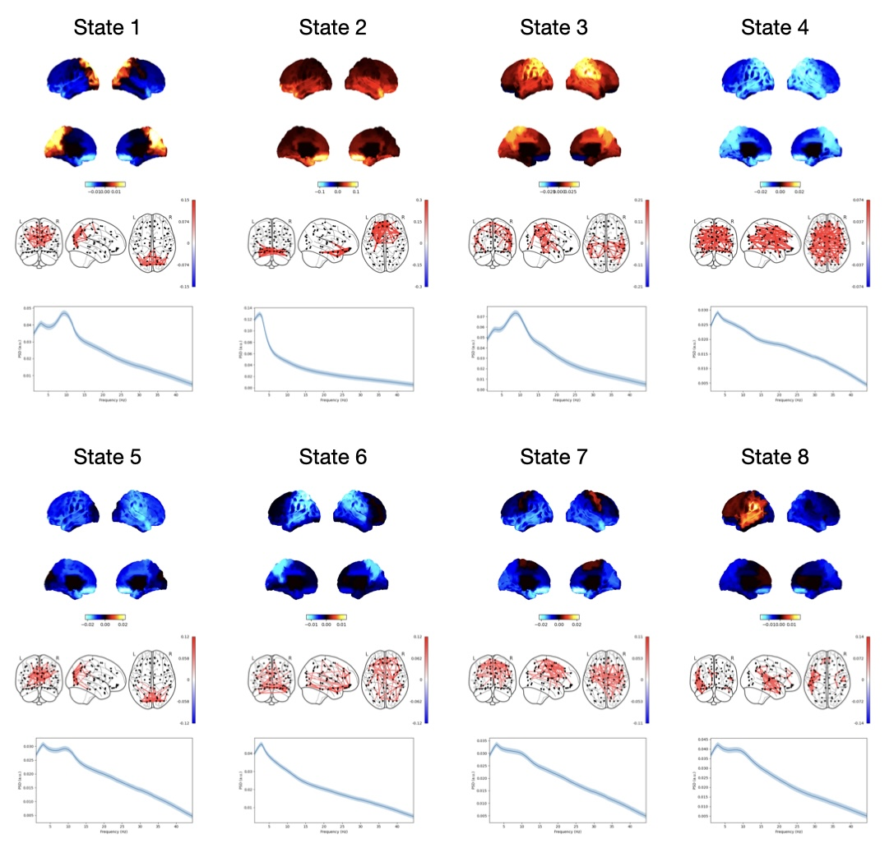

# TDE-HMM Network Analysis for Resting-State CTF Data

## Dataset

We use the public CTF data from the Nottingham in the MEGUK Partnership dataset: [https://meguk.ac.uk/database/](https://meguk.ac.uk/database/).

We use the resting-state (eyes open) data. These example scripts expect the data to be in the original directory structure in the public dataset:

```
data
|-- raw
    |-- Nottingham
        |-- sub-not001
            |-- meg
                |-- sub-not001_task-resteyesopen_meg.ds
                |-- ...
            |-- anat
                |-- sub-not001_T1w.nii.gz
                |-- ...
        |-- sub-not002
        |-- ...
```

## Pipeline

In this example we:

- `01_preprocess.py`: Preprocess the sensor-level data. This includes standard signal processing such as downsampling and filtering as well as artefact removal.
- `02_fix_smri_files.py`: Here, we fix a technical issue related to the format of how the structral MRI was save. This is specific to the MRC MEGUK dataset.
- `03_source_reconstruct.py`: Here, we coregister the MEG data and structural MRI, beamform the sensor-level data and parcellate to give us the source-level data. We use the AAL parcellation.
- `04_sign_flip.py`: Here, we fix the dipole sign ambiguity (we align the sign of the parcel time courses across subjects). This is needed if we're training a TDE-HMM.
- `05_train_hmm.py`: Train a time-delay embedded (TDE) Hidden Markov Model (HMM). We pass the number of states and a run ID to this script, e.g. `python 05_train_hmm.py 8 1`, where `8` is the number of states and `1` is the run ID. You generally want to train multiple HMMs (with different run IDs) and pick the best (lowest free energy) run.
- `06_print_free_energy.py`: This prints the free energy for each HMM run.
- `07_get_inf_params.py`: Get the inferred state probabilities, means and covariances. Note, with the TDE-HMM approach we set the state means to zero.
- `08_calc_multitaper.py`: Post-hoc calculation of subject and state-specific power/coherence spectra using a multitaper.
- `09_plot_networks.py`: Plot the group-average networks from the multitaper.
- `10_calc_summary_stats.py`: Calculate and plot the distribution of summary statistics for dynamics (fractional occupancy, lifetime, interval, switching rate) across subjects.

Note, there is a variable called `n_workers` in scripts `01`-`04` and `n_jobs` in scripts `05`-`10`, these should be set to the number of cores you would like to use.

## Results

You should expect to get something similar to the following results:



The above networks were from the best run of 10.
